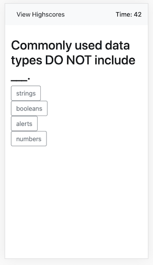
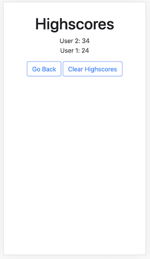

# Coding Assessment

## Application
Published on https://hngdngng.github.io/Coding-Assessment/

## Description
The goal of this project was to create a coding assessment application that includes a series of multiple-choice questions to test the user's coding knowledge. The user will be under a timer after beginning the assessment. At the end of the assessment the user shall be able to record their initials and view how they rank with other users on the same application.

## Languages
HTML5, CSS, JavaScript

## Features
The website features the following:
* Dynamically updated HTML and CSS powered by JavaScript
* Clean and responsive user interface adapting to multiple screen sizes
* Valid and correct HTML (using a validation service)
* Multiple choice questions
* Wrong answer penalty (-10)
* User scores on local storage
* Ranked highscores

The following image demonstrates the application functionality:

## Author
Hoang Nguyen
